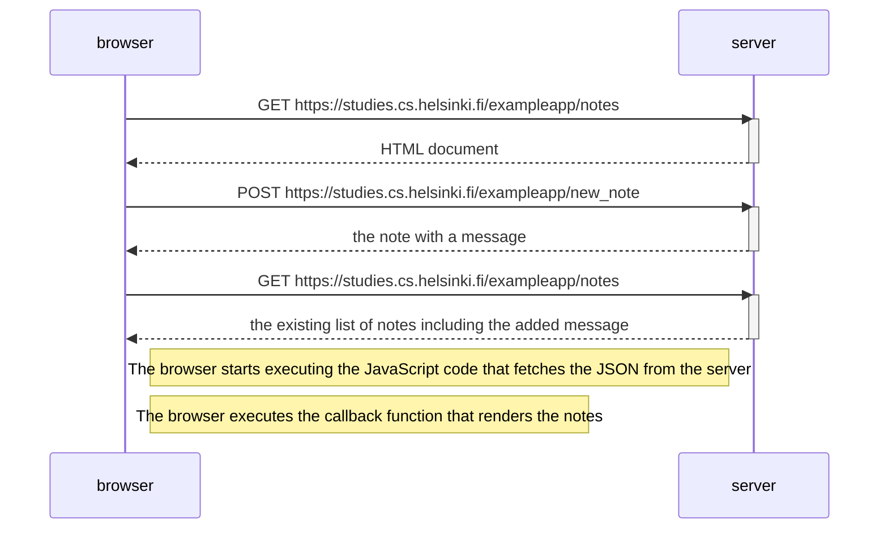

```mermaid
sequenceDiagram
    participant browser
    participant server

    browser->>server: GET https://studies.cs.helsinki.fi/exampleapp/notes
    activate server
    server-->>browser: HTML document
    deactivate server

    browser->>server: POST https://studies.cs.helsinki.fi/exampleapp/new_note
    activate server
    server-->>browser: the note with a message
    deactivate server

    browser->>server: GET https://studies.cs.helsinki.fi/exampleapp/notes
    activate server
    server-->>browser: the existing list of notes including the added message
    deactivate server

    Note right of browser: The browser starts executing the JavaScript code that fetches the JSON from the server

    Note right of browser: The browser executes the callback function that renders the notes
```
